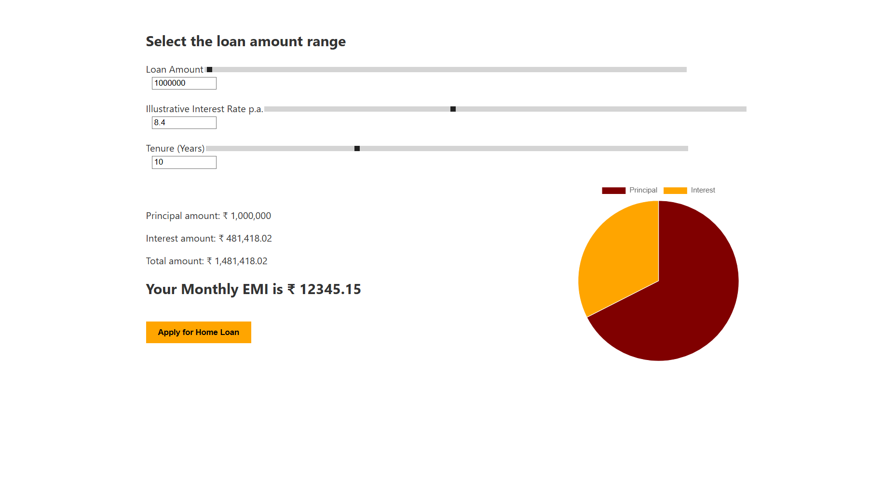

# EMI Calculator - Home Loan Estimator

This project is a React-based EMI (Equated Monthly Installment) calculator designed to help users estimate their home loan EMI, visualize the principal and interest breakdown, and understand the total repayment amount.

---

## Features

- Adjustable loan amount input (up to ₹30 Crore)
- Adjustable annual interest rate (1% to 20%)
- Flexible loan tenure (1 to 30 years)
- Pie chart visualization of principal vs interest
- Real-time EMI calculation on input change
- Clean, simple, and intuitive user interface

---

## Built With

- React JS (Functional Components and Hooks)
- Chart.js with react-chartjs-2 for chart rendering
- Plain CSS for styling

---

## Preview




```


````

---

## Getting Started

### Prerequisites

Make sure you have Node.js and npm installed on your machine.

### Installation

1. Clone the repository:

```bash
git clone https://github.com/your-username/emi-calculator.git
cd emi-calculator
````

2. Install dependencies:

```bash
npm install
```

3. Start the development server:

```bash
npm start
```

The application will run on `http://localhost:3000` by default.

---

## Folder Structure

```
emi-calculator/
├── public/
├── src/
│   ├── components/
│   │   ├── SliderInput.js
│   │   ├── ResultDisplay.js
│   │   └── PieChart.js
│   ├── App.js
│   ├── App.css
│   └── index.js
├── .gitignore
├── package.json
└── README.md
```

---

## License

This project is open-source and available for use under the MIT License.

```

---

Let me know if you want help:
- Hosting this on GitHub Pages or Netlify
- Adding a screenshot properly
- Adding a deployment link to this README
```
